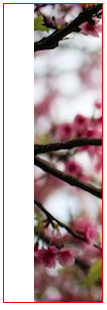

# Welcome To OA's imgLiquid!
這是一個 based on [jQuery](http://jquery.com/) 的前端 library。

---
## 聲明
本作品只限分享於研究、研討性質之使用，並不提供任何有營利效益之使用。  
如有營利用途，務必告知作者 OA(<comdan66@gmail.com>)，並且經由作者同意。


<br/>
## 簡介
* 這是一個前端 jQuery extend function，主要架構於 [jQuery](http://jquery.com/)。  

* Demo 範例頁面: [http://comdan66.github.io/OA-imgLiquid/](http://comdan66.github.io/OA-imgLiquid/)

<br/>
## 目錄
* [說明](#說明)
	* [圖解](#圖解)
	* [加入 jquery.js](#加入 jquery.js)
	* [加入 oa-imgLiquid.js](#加入 oa-imgLiquid.js)
	* [元素結構](#元素結構)
	* [元素 css 樣式](#元素 css 樣式)
	* [Javascript](#Javascript)
* [垂直](#垂直)
	* [垂直置中](#垂直置中)
	* [垂直置頂](#垂直置頂)
	* [垂直置底](#垂直置底)
	* [指定位置](#指定位置)
* [水平](#水平)
	* [水平置中](#水平置中)
	* [水平置左](#水平置左)
	* [水平置右](#水平置右)
	* [指定位置](#指定位置)
* [其他](#其他)
	* [範圍限制](#範圍限制)
	* [使用結構 data-position、data-overflow](#使用結構 data-position、data-overflow)
* [關於](#關於)
	

<br/>
## <a name="說明"></a>說明
* <a name="圖解"></a>圖解  


	
* <a name="加入 jquery.js"></a>加入 jquery.js

	```html
	<script src="jquery-1.10.2.min.js" language="javascript" type="text/javascript" /></script>
```

* <a name="加入 oa-imgLiquid.js"></a>加入 oa-imgLiquid.js

	```html
	<script src="oa-imgLiquid.js" language="javascript" type="text/javascript" /></script>
```

* <a name="元素結構"></a>元素結構

	```html
	<div class='oa-imgLiquid'>
	  
	</div>
```

* <a name="元素 css 樣式"></a>元素 css 樣式
	- 父層 **position** 一定要是 **position** 或 **absolute**。
	- 父層一定要有設定 **width** 或 **height**。
	
	```html
	<style>
	  .oa-imgLiquid {
	    position: relative; /* or absolute */

	    width: 360px;
	    height: 180px;
	  }
	</style>
```

* <a name="Javascript"></a>Javascript

	```javascript
	$('.oa-imgLiquid').OAimgLiquid ();
```

<br/>
## <a name="垂直"></a>垂直
* <a name="垂直置中"></a>垂直置**中**

	
	
	```html
	<div class='oa-imgLiquid'>
	  
	</div>
```

	```html
	<style>
	  .oa-imgLiquid {
	    position: relative;
	    width: 360px;
	    height: 100px;
	  }
	</style>
```

	```javascript
	$('.oa-imgLiquid').OAtab ();
 
	// or
 
	$('.oa-imgLiquid').OAtab ({
	  position: '='
	});
 
	// or
 
	$('.oa-imgLiquid').OAtab ({
	  position: '50%'
	});
```

* <a name="垂直置頂"></a>垂直置**頂**

	
	
	```html
	<div class='oa-imgLiquid'>
	  
	</div>
```

	```html
	<style>
	  .oa-imgLiquid {
	    position: relative;
	    width: 360px;
	    height: 100px;
	  }
	</style>
```

	```javascript
	$('.oa-imgLiquid').OAtab ({
	  position: '-'
	});
 
	// or
 
	$('.oa-imgLiquid').OAtab ({
	  position: '0%'
	});
 
	// or
 
	$('.oa-imgLiquid').OAtab ({
	  position: '0' // or '0px'
	});
```

* <a name="垂直置底"></a>垂直置**底**

	
	
	```html
	<div class='oa-imgLiquid'>
	  
	</div>
```

	```html
	<style>
	  .oa-imgLiquid {
	    position: relative;
	    width: 360px;
	    height: 100px;
	  }
	</style>
```

	```javascript
	$('.oa-imgLiquid').OAtab ({
	  position: '+'
	});
 
	// or
 
	$('.oa-imgLiquid').OAtab ({
	  position: '100%'
	});
```

* <a name="指定位置"></a>**指定**位置

	
	
	```html
	<div class='oa-imgLiquid'>
	  
	</div>
```

	```html
	<style>
	  .oa-imgLiquid {
	    position: relative;
	    width: 360px;
	    height: 100px;
	  }
	</style>
```

	```javascript
	$('.oa-imgLiquid').OAtab ({
	  position: '20px'
	});
  
	// or
 
	$('.oa-imgLiquid').OAtab ({
	  position: '20%'
	});
```

<br/>
## <a name="水平"></a>水平
* <a name="水平置中"></a>水平置**中**

	
	
	```html
	<div class='oa-imgLiquid'>
	  
	</div>
```

	```html
	<style>
	  .oa-imgLiquid {
	    position: relative;
	    width: 100px;
	    height: 300px;
	  }
	</style>
```

	```javascript
	$('.oa-imgLiquid').OAtab ();
 
	// or
 
	$('.oa-imgLiquid').OAtab ({
	  position: '='
	});
 
	// or
 
	$('.oa-imgLiquid').OAtab ({
	  position: '50%'
	});
```

* <a name="水平置左"></a>水平置**左**

	
	
	```html
	<div class='oa-imgLiquid'>
	  
	</div>
```

	```html
	<style>
	  .oa-imgLiquid {
	    position: relative;
	    width: 100px;
	    height: 300px;
	  }
	</style>
```

	```javascript
	$('.oa-imgLiquid').OAtab ({
	  position: '-'
	});
 
	// or
 
	$('.oa-imgLiquid').OAtab ({
	  position: '0%'
	});
 
	// or
 
	$('.oa-imgLiquid').OAtab ({
	  position: '0' // or '0px'
	});
```

* <a name="水平置右"></a>水平置**右**

	
	
	```html
	<div class='oa-imgLiquid'>
	  
	</div>
```

	```html
	<style>
	  .oa-imgLiquid {
	    position: relative;
	    width: 100px;
	    height: 300px;
	  }
	</style>
```

	```javascript
	$('.oa-imgLiquid').OAtab ({
	  position: '+'
	  });
 
	 // or
 
	$('.oa-imgLiquid').OAtab ({
	  position: '100%'
	});
```

* <a name="指定位置"></a>**指定**位置

	
	
	```html
	<div class='oa-imgLiquid'>
	  
	</div>
```

	```html
	<style>
	  .oa-imgLiquid {
	    position: relative;
	    width: 100px;
	    height: 300px;
	  }
	</style>
```

	```javascript
	$('.oa-imgLiquid').OAtab ({
	  position: '30px'
	});
  
	// or
 
	$('.oa-imgLiquid').OAtab ({
	  position: '30%'
	});
```

<br/>
## <a name="其他"></a>其他
* <a name="範圍限制"></a>範圍限制

	
	
	```html
	<div class='oa-imgLiquid'>
	  
	</div>
```

	```html
	<style>
	  .oa-imgLiquid {
	    position: relative;
	    width: 300px;
	    height: 100px;
	  }
	</style>
```

	```javascript
	$('.oa-imgLiquid').OAtab ({
	  overflow: true,
	  position: '-30px'
	});
```

* <a name="使用結構 data-position、data-overflow"></a>使用結構 **data-position**、**data-overflow**

	
	
	```html
	<div class='oa-imgLiquid' data-position='-30px' data-overflow='true'>
		
	</div>
```

	```html
	<style>
	  .oa-imgLiquid {
	    position: relative;
	    width: 100px;
	    height: 300px;
	}
	</style>
```

	```javascript
	$('.oa-imgLiquid').OAtab ();
```

<br/>
## <a name="關於"></a>關於
* 作者名稱 - [OA Wu](https://github.com/comdan66)

* 作品名稱 - OAimgLiquid

* 最新版本 - 1.0.0

* GitHub - [OA-imgLiquid](https://github.com/comdan66/OA-imgLiquid)

* 更新日期 - 2014/11/30